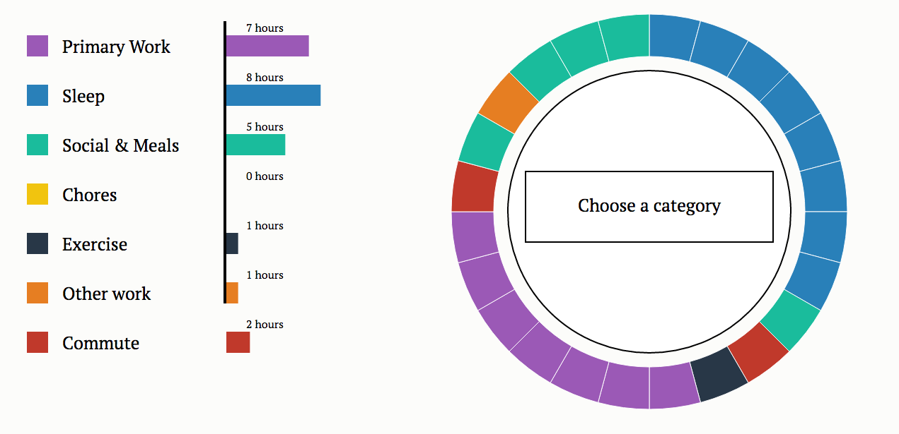

# The Color Wheel of Life
The Creative Clock is an interactive app that visually displays how you spend your day. The idea came from an infographic I saw a few years ago. The graphic explained how creativity is elusive -- many famous creatives over the course of history have chosen to spend their days very different. How do you spend your day?

